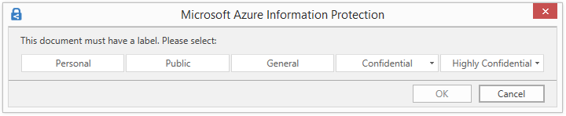

# Configuración directivas para Azure Information Protection

>*Se aplica a: Azure Information Protection*

Además de la barra de título y de la información sobre herramientas de Information Protection, hay algunas configuraciones en la directiva de Azure Information Protection que se aplican a todos los usuarios y todos los dispositivos:

Para establecer la configuración:

1. Si aún no lo ha hecho, abra una nueva ventana del explorador, inicie sesión en [Azure Portal](https://portal.azure.com) como administrador de seguridad o administrador global y, después, navegue hasta la hoja **Azure Information Protection**. 
    
    Por ejemplo, en el menú del centro, haga clic en **Más servicios** y comience a escribir **Information** en el cuadro Filtro. Seleccione **Azure Information Protection**.

2. Si está configuración que quiere realizar se aplica a todos los usuarios, realice la siguiente configuración global en la hoja **Policy: Global** (Directiva: Global):
    
    - **All documents and emails must have a label** (Todos los documentos y correos electrónicos deben tener una etiqueta): cuando establece esta opción en **On** (Activado), todos los documentos guardados y correos electrónicos enviados deben tener aplicada una etiqueta. El etiquetado puede asignarlo manualmente un usuario, se puede asignar automáticamente como resultado de una [condición](configure-policy-classification.md) o asignarse de forma predeterminada (configurando la opción **Select the default label** [Seleccionar la etiqueta predeterminada]). 
        
        Si no se asigna una etiqueta cuando un usuario guarda un documento o envía un correo electrónico, se le pide que seleccione una etiqueta. Por ejemplo:
        
        
        
    - **Select the default label** (Seleccionar la etiqueta predeterminada): cuando configure esta opción, seleccione la etiqueta que se asignará a documentos y correos electrónicos que no tienen una. No se puede configurar una etiqueta como predeterminada si tiene etiquetas secundarias. 
        
    - **Para establecer una etiqueta de clasificación menor, eliminar una etiqueta o quitar la protección, los usuarios deben proporcionar una justificación al respecto**: cuando se **activa** esta opción y un usuario realiza una de estas acciones (por ejemplo, si cambia la etiqueta **Público** por **Personal**), se le pide al usuario que indique el motivo de esta acción. Por ejemplo, el usuario podría explicar que el documento ya no contiene información confidencial. La acción y el motivo de justificación se registran en el registro de eventos local de Windows: **Aplicación** > **Microsoft Azure Information Protection**.  
        
        
        
        Esta opción no es aplicable a las etiquetas secundarias.
        
    - **Para los mensajes de correo electrónico con datos adjuntos, aplicar una etiqueta que coincida con la clasificación más alta de los archivos adjuntos**: cuando se establece esta opción en **Recomendado**, se pide a los usuarios que apliquen una etiqueta a su mensaje de correo electrónico. La etiqueta se elige de manera dinámica, basándose en las etiquetas de clasificación que se han aplicado a los archivos adjuntos, y se selecciona la etiqueta de clasificación más alta. Los datos adjuntos deben ser un archivo físico y no pueden ser un vínculo a un archivo (por ejemplo, un vínculo a un archivo en SharePoint o OneDrive para la Empresa). Los usuarios pueden aceptar la recomendación o descartarla. Cuando se **activa** esta opción, la etiqueta se aplica automáticamente pero los usuarios pueden quitar la etiqueta o seleccionar una etiqueta distinta antes de enviar el mensaje de correo.  

    - **Proporcionar una dirección URL personalizada para la página de web "Más información" del cliente Azure Information Protection**: los usuarios ven este vínculo en el cuadro de diálogo de **Microsoft Azure Information Protection**, sección **Ayuda y comentarios**, cuando seleccionan **Proteger** > **Ayuda y comentarios** en la ficha **Inicio** de las aplicaciones de Office. De forma predeterminada, este vínculo dirige al sitio web de [Azure Information Protection](https://www.microsoft.com/cloud-platform/azure-information-protection). Puede especificar una URL HTTP o HTTPS (recomendado) si quiere que este vínculo dirija a una página web alternativa. No se realiza ninguna comprobación para verificar que la dirección URL personalizada es accesible o se muestra correctamente en todos los dispositivos.
        
        Por ejemplo, para el soporte técnico, puede escribir la página de documentación de Microsoft que incluye información sobre cómo instalar y usar el cliente (**https://docs.microsoft.com/information-protection/rms-client/info-protect-client**) o información de la versión de lanzamiento (**https://docs.microsoft.com/information-protection/rms-client/client-version-release-history**). También puede publicar su propia página web que incluya información para que los usuarios se pongan en contacto con el soporte técnico o un vídeo en el que se muestre a los usuarios cómo deben usar las etiquetas que haya configurado.
        
         Esta configuración se puede sobrescribir para usuarios especificados cuando haya creado una [directiva de ámbito](configure-policy-scope.md). Para realizar esta configuración en una directiva de ámbito, seleccione primero la directiva de ámbito de la hoja inicial **Azure Information Protection**.

3. Para guardar los cambios, haga clic en **Guardar**.

4. Para que los cambios estén disponibles para los usuarios, en la hoja inicial de **Azure Information Protection**, haga clic en **Publicar**.

## Pasos siguientes

Para más información sobre cómo configurar la directiva de Azure Information Protection, use los vínculos de la sección [Configuring your organization's policy](configure-policy.md#configuring-your-organizations-policy) (Configuración de la directiva de la organización).  

[!INCLUDE[Commenting house rules](../includes/houserules.md)]
