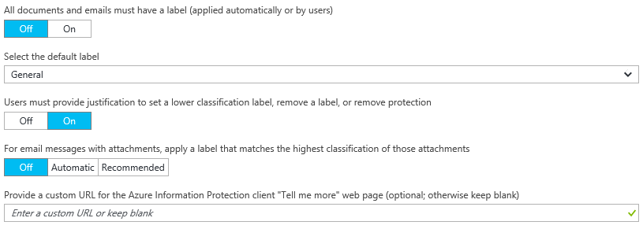

# Paso 2: Configuración de la directiva de Azure Information Protection

>*Se aplica a: [Azure Information Protection](https://azure.microsoft.com/pricing/details/information-protection)*

Aunque Azure Information Protection incluye una directiva predeterminada que se puede usar sin necesidad de configuración, echaremos un vistazo a esa directiva y haremos algunos cambios.

1. Si continúa desde el [paso 1](infoprotect-tutorial-step1.md) y sin salir de Azure Portal, seleccione **CLASIFICACIONES** > **Directivas** > **Global** para abrir la hoja **Directiva: Global**. Esta hoja muestra la directiva de Azure Information Protection predeterminada que se crea para el inquilino.

2. Dedique unos minutos a familiarizarse con las etiquetas que se muestran:
    
    - Etiquetas de clasificación: **Personal**, **Público**, **General**, **Confidencial** y **Extremadamente confidencial**. Las dos últimas etiquetas se expanden y muestran subetiquetas, que proporcionan ejemplos de cómo una clasificación puede tener subcategorías:
    
       > [!NOTE]
       > Es posible que su directiva predeterminada sea ligeramente diferente a la de este tutorial. Por ejemplo, tiene una etiqueta denominada **Interno** en lugar de **General**, y **Secreto** en lugar de **Extremadamente confidencial**. Quizá no tenga las subetiquetas denominadas **Solo destinatarios**, o no tenga ninguna etiqueta en absoluto. Estos cambios se deben a que hay diferentes versiones de la directiva predeterminada, en función de cuándo se ha creado para el inquilino. O bien, es posible que la haya editado manualmente antes de iniciar el tutorial.
       > 
       > Si la directiva predeterminada tiene un aspecto diferente, puede seguir usando este tutorial, pero sea consciente de estos cambios al usar las instrucciones y las imágenes siguientes. Si quiere modificar la directiva predeterminada para que coincida con la directiva predeterminada actual, vea [Directiva predeterminada de Azure Information Protection](../deploy-use/configure-policy-default.md).
    
    - Con la configuración predeterminada, algunas etiquetas no tienen distintivos visuales configurados. Los marcadores visuales son pie de página, encabezado y marca de agua. En función de la directiva predeterminada, algunas etiquetas también podrían tener protección establecida. Por ejemplo: 
    
    
    
3. También verá que hay algunas configuraciones de directiva. Por ejemplo, no hay ninguna etiqueta predeterminada establecida, no se requiere que los documentos y los correos electrónicos tengan una etiqueta y los usuarios no tienen que dar ninguna justificación cuando cambian etiquetas:
    
    

## Cambiar la configuración de una etiqueta predeterminada y solicitar la justificación

En este tutorial, se cambiarán algunas de esas configuraciones de directiva para que pueda ver cómo funcionan:

1. Para la opción **Seleccione la etiqueta predeterminada**, elija **General**. 

    Si no tiene esta etiqueta porque tiene una versión anterior de la directiva, elija **Interno** como etiqueta equivalente.

2. En **Para establecer una etiqueta de clasificación menor, eliminar una etiqueta o quitar la protección, los usuarios deben dar una justificación al respecto**, establezca esta opción en **Activado**.

3. Busque también la opción **Configuración de la opción de permisos personalizados para que esté disponible para los usuarios**. Si está establecida en **Desactivado**, cámbiela a **Activado**.
    
    Es posible que no tenga que cambiarla, ya que el valor predeterminado depende del momento en el que obtuvo la suscripción. Usaremos permisos personalizados más adelante en el tutorial para compartir un documento protegido con el usuario que especifique. Para ello, debe hacer clic con el botón derecho en el archivo en el Explorador de archivos.

4. Seleccione **Guardar** en la hoja **Policy: Global** (Directiva: Global) y, si se le pide que confirme la acción, seleccione **Aceptar**. Cierre esta página.

## Crear una etiqueta para protección, marcadores visuales y una condición para solicitar la clasificación

Ahora vamos a crear una subetiqueta para **Confidencial**.

1. Desde la opción de menú **CLASIFICACIONES** > **Etiquetas**: haga clic en la etiqueta **Confidencial** y elija **Agregar una subetiqueta**.
    
    Si no tiene una etiqueta denominada **Confidencial**, puede seleccionar otra etiqueta o crear una etiqueta y seguir el tutorial con pequeñas diferencias.

2. En la hoja **Subetiqueta**, especifique el nombre de etiqueta **Finanzas** y agregue la descripción siguiente: **Datos confidenciales que contienen información financiera restringida únicamente a los empleados**.
    
    Este texto describe cómo se piensa usar la etiqueta seleccionada y es visible para los usuarios como una información sobre herramientas, para ayudarles a decidir la etiqueta que se va a seleccionar.

3. En **Establecer permisos para documentos y correos electrónicos que contengan esta etiqueta**, seleccione **Proteger** y, luego, **Protección**:
    
     
    
4. En la hoja **Protección**, asegúrese de que **Azure (clave en la nube)** esté seleccionado. Esta opción usa el servicio Azure Rights Management para proteger documentos y mensajes de correo electrónico. Asegúrese de que la opción **Establecer permisos** también está seleccionada. Después, seleccione **Agregar permisos**.

5. En la hoja **Agregar permisos**, seleccione **Agregar \<nombre de organización> -Todos los miembros**. Por ejemplo, si el nombre de la organización es VanArsdel Ltd, verá la siguiente opción:
    
     
    
    Esta opción selecciona automáticamente todos los usuarios de la organización a los que se pueden conceder permisos. Pero puede ver en las otras opciones que ya podía examinar y buscar grupos o usuarios del inquilino. O bien, al seleccionar la opción **Escriba los detalles**, puede especificar direcciones de correo electrónico individuales o incluso todos los usuarios de otra organización.

6. Para los permisos, seleccione **Revisor** entre las opciones preestablecidas. Verá que este nivel de permiso concede automáticamente algunos de los permisos que se muestran, pero no todos:
    
    
    
    Puede seleccionar distintos niveles de permisos o especificar derechos de uso individuales mediante la opción **Personalizado**. Pero para este tutorial, use la opción **Revisor**. Puede experimentar con distintos permisos más adelante y leer cómo restringen lo que los usuarios especificados pueden hacer con el documento o correo electrónico protegido.

7. Haga clic en **Aceptar** para cerrar la hoja **Agregar permisos** y ver cómo se actualiza la hoja **Protección** para reflejar la configuración. Por ejemplo:
    
     
    
    Si selecciona **Agregar permisos**, se volverá a abrir la hoja **Agregar permisos** para que pueda agregar más usuarios y concederles permisos diferentes. Por ejemplo, puede conceder únicamente acceso de vista a un grupo específico. Pero para este tutorial, usaremos un conjunto de permisos para todos los usuarios.

8. Revise y mantenga los valores predeterminados para la expiración del contenido y el acceso sin conexión y, después, haga clic en **Aceptar** para guardar y cerrar la hoja **Protección**.

8. De nuevo en la hoja **Subetiqueta**, busque la sección **Establecer un distintivo visual**:
    
    Para la opción **Los documentos con esta etiqueta tienen un pie de página**, haga clic en **Activado** y, en el cuadro **Texto**, escriba **Clasificado como confidencial**. 
    
    Para la opción **Los documentos que tienen esta etiqueta tienen una marca de agua**, haga clic en **Activado** y, en el cuadro **Texto**, escriba el nombre de la organización. Por ejemplo, **VanArsdel, Ltd**. 
    
    Aunque es posible cambiar el aspecto de estos marcadores visuales, dejaremos estas opciones en sus valores predeterminados por ahora.
    
9. Busque la sección **Configurar condiciones para aplicar automáticamente esta etiqueta**:
    
    Haga clic en **Agregar una nueva condición** y, después, en la hoja **Condición**, seleccione lo siguiente:
    
    a. **Elija el tipo de condición**: mantenga el valor predeterminado de **Tipos de información**.
    
    b. En el cuadro de búsqueda **Seleccione los tipos de información**: escriba **número de la tarjeta de crédito**. Después, en los resultados de la búsqueda, seleccione **Número de la tarjeta de crédito**.
    
    c. **Número mínimo de repeticiones**: mantenga el valor predeterminado de **1**.
    
    d. **Contar solo las repeticiones con valores únicos**: mantenga el valor predeterminado en **Desactivado**.
    
    
    
    Haga clic en **Guardar** para volver a la hoja **Subetiqueta**.

10. En la hoja **Subetiqueta**, puede ver que aparece **Número de la tarjeta de crédito** como **NOMBRE DE CONDICIÓN** con **1** **REPETICIONES**:
    
    

11. Para **Seleccione el modo de aplicación de esta etiqueta**: mantenga el valor predeterminado de **Recomendado** y no cambie la sugerencia de la directiva predeterminada. 

12. En el cuadro **Enter notes for internal housekeeping**(Escribir notas para mantenimiento interno), escriba **Solo con fines de prueba**.

13. Haga clic en **Guardar** en la hoja **Subetiqueta**. Si se le pide que confirme, haga clic en **Aceptar**. La nueva etiqueta se crea y se guarda, pero no se agrega aún a una directiva.

14. Desde la opción de menú **CLASIFICACIONES** > **Directivas**: seleccione **Global** de nuevo y, a continuación, seleccione el vínculo **Agregar o quitar etiquetas** después de las etiquetas.

15. En la hoja **Directiva: agregar o quitar etiquetas**, seleccione la etiqueta que acaba de crear y la etiqueta denominada **Finanzas** y haga clic en **Aceptar**.

16. En la hoja **Policy: Global** (Directiva:global), ahora verá la nueva subetiqueta en la directiva global, que está configurada para distintivos visuales y protección. Por ejemplo:

    
    
    También verá que los valores se configuran con los cambios correspondientes a la etiqueta y la justificación predeterminadas:
    
    
    

17. Haga clic en **Guardar** en la hoja **Policy: Global** (Directiva:global). Si se le pide que confirme esta acción, haga clic en **Aceptar**.

Puede cerrar el portal de Azure o dejarlo abierto para probar opciones de configuración adicionales cuando haya terminado este tutorial.

Ahora que ya ha dado un vistazo a la directiva predeterminada y ha hecho algunos cambios, el siguiente paso consiste en instalar el cliente de Azure Information Protection.

|Si desea obtener más información|Información adicional|
|--------------------------------|--------------------------|
|Acerca de la directiva predeterminada y las diferentes versiones|[Directiva predeterminada de Azure Information Protection](../deploy-use/configure-policy-default.md)|
|Configuración de la directiva|[Configuración de la directiva de Azure Information Protection](../deploy-use/configure-policy.md)|
|Instrucciones detalladas para configurar una etiqueta para la protección|[Cómo configurar una etiqueta para la protección de Rights Management](../deploy-use/configure-policy-protection.md)|
|Información detallada sobre los permisos|[Configurar los derechos de uso para Azure Rights Management](../deploy-use/configure-usage-rights.md)|

>[!div class="step-by-step"]
[&#171; Paso 1](infoprotect-tutorial-step1.md)
[Paso 3 &#187;](infoprotect-tutorial-step3.md)

[!INCLUDE[Commenting house rules](../includes/houserules.md)]