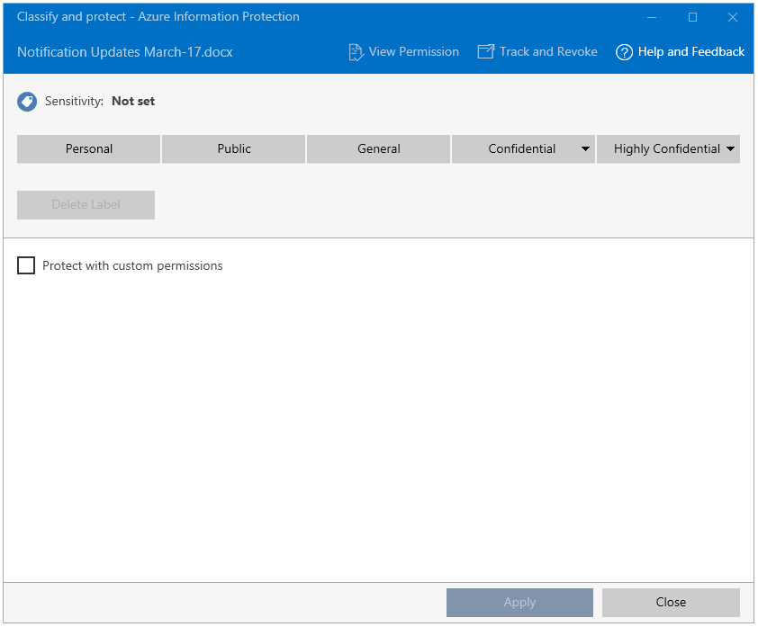

# Paso 5: ver el funcionamiento del uso compartido de archivos protegidos y realizar un seguimiento del documento 

>*Se aplica a: [Azure Information Protection](https://azure.microsoft.com/pricing/details/information-protection)*

Para este paso final del tutorial, busque un documento de Word o una hoja del cálculo de Excel que ya haya creado y envíelos a un asociado o compañero de trabajo. Para este tutorial, lo que importa no es el texto en concreto, si no el hecho de que haya texto para confirmar más fácilmente si el recipiente autorizado puede leerlo.

A continuación, estará listo para compartir de forma segura este documento por correo electrónico. 

## Para compartir de forma segura el documento por correo electrónico

1. En el Explorador de archivos, haga clic con el botón derecho en el documento y seleccione **Clasificar y proteger**. Se abre el cuadro de diálogo **Clasificar y proteger: Azure Information Protection**:

    

2. Seleccione **Protect with custom permissions** (Proteger con permisos personalizados), que muestra opciones adicionales.

3. Para **Seleccionar permisos**, mantenga el valor predeterminado de **Visor – Solo ver**.

    Con esta configuración, los destinatarios podrán ver el documento pero no editarlo ni imprimirlo.

4. Para **Seleccionar usuarios**, escriba una o varias direcciones de correo electrónico empresarial, como lo haría cuando envía un documento a alguien con el que su organización trabaja. Para especificar más de una dirección, use un punto y coma o presione Entrar. 

    Asegúrese de especificar una dirección de correo electrónico empresarial, como **janetm@contoso.com** o **p.dover@fabrikam.com**, ya que de momento Azure Information Protection no admite direcciones de correo electrónico personales para este escenario. 

    También puede hacer clic en el icono **Seleccionar usuarios, grupos u organización** para seleccionar la dirección de correo electrónico de un compañero de trabajo:

      
    
    Después de especificar las direcciones, cópielas en el Portapapeles porque se van a usar en un paso posterior.

5. Haga clic en **Aplicar** y espere a que aparezca el mensaje **Trabajo finalizado** para ver los resultados. A continuación, haga clic en **Cerrar**.

4. En el Explorador de archivos, vuelva a hacer clic con el botón derecho en el archivo y, esta vez, seleccione **Enviar a** > **Destinatario de correo**. Esta acción adjunta el documento a un mensaje de correo electrónico con texto predeterminado que se modificará.

5. Antes de cambiar el texto predeterminado, pegue las direcciones de correo electrónico que especificó anteriormente en el cuadro **A**. 

6. Si lo desea, escriba un texto de su elección en el campo **Asunto**; por ejemplo: **El archivo compartido está protegido**. 

7. Modifique la descripción del mensaje predeterminada para que sea adecuada para los destinatarios. No obstante, agregue el texto siguiente:

    **He protegido este archivo con Microsoft Azure Information Protection. Para el primer uso, vea estas instrucciones: https://aka.ms/rms-signup.** 

    

    Haga clic en **Enviar**.

Ahora que ha enviado el documento protegido, está listo para pedir a los destinatarios que esperen a que llegue para luego abrirlo. 

## Pedir a los destinatarios que abran el documento por correo electrónico

Los destinatarios pueden usar muchos dispositivos para leer el documento protegido que envía como datos adjuntos por correo electrónico. Entre los dispositivos, se encuentran el iPad, el iPhone, tabletas y teléfonos Android, y equipos Mac, así como los equipos Windows.

Pídales que lean el mensaje de correo electrónico que ha enviado. Teniendo en cuenta que esta es la primera vez que han recibido datos adjuntos que están protegidos por Rights Management, solicíteles que hagan clic en el vínculo de las instrucciones. A continuación, aparece la página de **bienvenida** de Microsoft Azure Information Protection, donde se pide escribir la dirección de correo electrónico profesional.

Al hacer clic en **Registrarse**, Azure Information Protection comprueba si la organización tiene una suscripción que incluye el servicio de protección de datos Azure Rights Management. Si no es así, se puede solicitar una cuenta gratuita.

### Instrucciones para los destinatarios: para ver los datos adjuntos del documento protegido

1. En un equipo o dispositivo móvil que tenga instalado Office, abra el archivo adjunto para leer el documento.  

2.  Si se le pide su nombre de usuario y contraseña, escriba su nombre de usuario en el mismo formato que la dirección de correo electrónico que se usó para enviarle el correo electrónico y los datos adjuntos. Por ejemplo, **janetm@contoso.com** o **p.dover@fabrikam.com**. Para la contraseña, escriba la contraseña que proporcionó al suscribirse a RMS para usuarios. O, si su organización tiene un servicio en la nube como Office 365 o usa Azure, escriba su contraseña de trabajo habitual.

3. Lea el contenido del documento cuando se abra. Debido a que es de solo lectura, no puede cambiar el contenido.

Como paso opcional, el destinatario puede reenviar el correo electrónico a otras personas que no ha especificado en el correo electrónico original. Estas personas no podrán abrir el documento adjunto. Cuando se les pide el nombre de usuario, se deniega el acceso al documento.

Ahora que el destinatario ha abierto el archivo adjunto y lo ha reenviado de forma opcional a alguien más, ya puede realizar el seguimiento del documento.

## Para hacer un seguimiento de un documento protegido

1.  Abra el documento que ha protegido y compartido. El banner informativo confirma la configuración de protección personalizada especificada:

    

2.  En la pestaña **Inicio**, haga clic en **Proteger** > **Realizar un seguimiento y revocar**:

    

    Esto le lleva al sitio de seguimiento de documentos.

2.  Si ve la página **Proteger y compartir en sus términos**, haga clic en **Iniciar sesión** y proporcione su nombre de usuario y contraseña nuevamente.

3.  En la página **Sus documentos compartidos**, verá el nombre del documento que ha compartido. En este punto, es el único archivo que aparece, pero a medida que comparta más documentos protegidos, la lista aumentará.

    En esta página, verá la fecha en la que compartió el documento (cuándo envió el correo electrónico con el archivo adjunto protegido), su estado actual (activo, revocado o expirado) y el nombre del destinatario al que envió el correo electrónico. Haga clic en el nombre del documento para obtener detalles adicionales.

4.  En la página nueva, que tiene el nombre del archivo en el que hizo clic, verá los detalles de resumen solo para ese documento y una lista de otras opciones que están disponibles para el documento (**Lista**, **Escala de tiempo**, **Mapa**, **Configuración**).

    Haga clic en cada opción para explorar maneras diferentes para hacer un seguimiento de un documento protegido. O bien, también en la página **Resumen** , haga clic en **Abrir en Excel** para exportar la información a una hoja de cálculo o en **Revocar acceso** para dejar de compartir el documento.

Puede volver a este sitio para realizar un seguimiento de más actividad relacionada con su documento protegido o revocar el acceso si es necesario. Incluso puede acceder al sitio desde su dispositivo móvil o tableta mediante un explorador con este vínculo: [seguimiento de documentos](http://go.microsoft.com/fwlink/?LinkId=529562)

|Si desea obtener más información|Información adicional|
|--------------------------------|--------------------------|
|Instrucciones completas para la protección de archivos que puede compartir con seguridad|[Clasificación y protección de un archivo o una dirección de correo electrónico](./rms-client/client-classify-protect.md)|
|Sobre la cuenta gratuita para que se registren otros usuarios|[RMS para individuos y Azure Rights Management](./rms-for-individuals.md)|
|Sobre usar el sitio de seguimiento de documentos|[Realizar un seguimiento de los documentos y revocarlos](./rms-client/client-track-revoke.md)

## Pasos siguientes

Ahora que ha visto la directiva predeterminada de Azure Information Protection, cómo personalizarla y cómo funciona el etiquetado en un documento de Word, pruebe algunas de las otras opciones y vea cómo funcionan en otras aplicaciones de Office que son compatibles con Azure Information Protection: Excel, PowerPoint u Outlook. Si estas aplicaciones estaban abiertas al instalar el cliente de Azure Information Protection, ciérrelas y vuelva a abrirlas antes de intentar usarlas con Azure Information Protection.

Intente compartir más documentos y realice un seguimiento de cómo se usan y confirme cómo funciona la revocación de documentos.

Después, puede encontrar útil volver a la página **Inicio rápido** en Azure Portal, leer algunas de las [preguntas más frecuentes](faqs.md) de Azure Information Protection y explorar algunos de los demás artículos de documentación. Pero si no está listo para empezar a implementar Azure Information Protection en su organización, el siguiente paso será el [mapa de ruta de implementación de Azure Information Protection](deployment-roadmap.md). 
