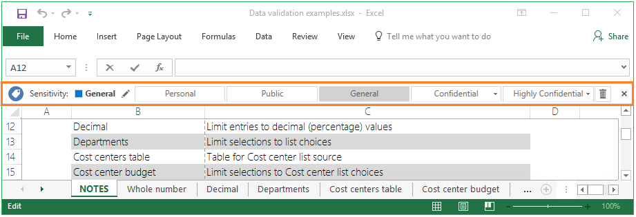

# ¿Qué es Azure Information Protection?

>*Se aplica a: Azure Information Protection*

Azure Information Protection es una solución basada en la nube que ayuda a una organización a clasificar, etiquetar y proteger sus documentos y correos electrónicos. Esto puede realizarse automáticamente por administradores que definen reglas y condiciones, manualmente por los usuarios o una combinación en la que los usuarios reciben recomendaciones. 

La siguiente imagen muestra un ejemplo de Azure Information Protection en funcionamiento. El administrador ha configurado reglas para detectar datos confidenciales (en este caso, información de tarjeta de crédito). Cuando un usuario guarda un documento de Word que contiene información de tarjeta de crédito, ve una información sobre herramientas personalizada que recomienda que aplique una etiqueta específica que el administrador ha configurado. Esta clasifica y, opcionalmente, protege el documento. 

Después de que su contenido se clasifique (y se proteja opcionalmente), puede realizar un seguimiento posterior y controlar cómo se usa. Puede analizar los flujos de datos para obtener información sobre su negocio, detectar comportamientos de riesgo y tomar medidas correctivas, realizar un seguimiento del acceso a los documentos y evitar la pérdida o el uso indebido de datos entre otros.

## Cómo aplican la clasificación las etiquetas

Use las etiquetas de Azure Information Protection para aplicar la clasificación a los documentos y correos electrónicos. Al hacer esto, la clasificación se puede identificar en cualquier momento, independientemente de dónde se almacenen los datos o con quién se compartan. Las etiquetas incluyen distintivos visuales, como encabezados, pies de página o marcas de agua. Los metadatos se agregan a los archivos y a los encabezados de correo electrónico en texto no cifrado de forma que otros servicios (como las soluciones de prevención de pérdida de datos) puedan identificar la clasificación y tomar las medidas oportunas. 

Por ejemplo, el siguiente mensaje de correo electrónico se ha clasificado como "Interno". Esta etiqueta se agrega como un pie de página al mensaje de correo electrónico, como un indicador visual para todos los destinatarios de que está destinado a un uso interno y no debe enviarse fuera de la organización. Esta etiqueta también se inserta en los encabezados de correo electrónico de forma que los servicios de correo electrónico puedan inspeccionar este valor y puedan crear una entrada de auditoría o evitar que se envíen fuera de la organización.

## Cómo se protegen los datos

La tecnología de protección usa *Azure Rights Management* (a menudo abreviado como Azure RMS). Esta tecnología se integra en otros servicios en la nube de Microsoft y en las aplicaciones tales como Office 365 y Azure Active Directory. También lo puede usar con sus propias aplicaciones de línea de negocio y soluciones de protección de información de proveedores de software, tanto si estas aplicaciones y soluciones son locales como en la nube.

Esta tecnología de protección usa directivas de autorización, identidad y cifrado. De manera similar a las etiquetas que se aplican, la protección que se aplica mediante Rights Management permanece con los documentos y los correos electrónicos, independientemente de la ubicación, ya sea dentro o fuera de la organización, las redes, los servidores de archivos y las aplicaciones. Esta solución de protección de información le permite seguir controlando sus datos, incluso cuando estos se comparten con otros usuarios.

Por ejemplo, puede configurar un informe o una hoja de cálculo de previsión de ventas para que solamente pueda tener acceso gente de la organización, y controlar si se puede editar un documento, si se restringe a solo lectura o si se impide que se pueda imprimir. Puedes configurar los correos electrónicos de forma similar y, además, evitar que se puedan reenviar o evitar que se use la opción Responder a todos. Estas tareas de protección se pueden simplificar mediante el uso de *plantillas de administración de derechos*.

### Plantillas de administración de derechos

Tan pronto como active el servicio Azure Rights Management, se crean dos plantillas predeterminadas que restringen el acceso a los datos de los usuarios de su organización. Puede usar estas plantillas para ayudar a evitar inmediatamente la pérdida de datos de su organización. También puede complementar estas plantillas determinadas al configurar sus propias plantillas personalizadas que aplican controles más restrictivos.

Estas plantillas pueden ser parte de una configuración de etiqueta, de forma que cuando una etiqueta específica se aplique a un documento (o mensaje de correo electrónico), los datos se clasifican y se protegen automáticamente. Las plantillas también pueden seleccionarse por usuarios o administradores en productos y servicios que admiten la tecnología de Azure Rights Management.

En este ejemplo se muestra cómo puede seleccionar una plantilla para una etiqueta cuando configura la directiva de Azure Information Protection desde Azure Portal:

Las mismas plantillas pueden seleccionarse desde el Centro de administración de Exchange para configurar reglas de flujo del correo de Exchange Online, que admiten la tecnología de Azure Rights Management:

Para más información sobre la protección de Azure Rights Management, vea [¿Qué es Azure Rights Management?](what-is-azure-rms.md).

## Integración con flujos de trabajo del usuario final

Azure Information Protection se integra con los flujos de trabajo existentes de usuarios finales cuando se instala el cliente de Azure Information Protection. Este cliente instala la barra de Information Protection en aplicaciones de Office, que hemos visto en la primera imagen. Se agrega la misma barra en Excel, PowerPoint y Outlook. Por ejemplo:

Esta barra de Information Protection facilita a los usuarios finales la selección de etiquetas para la correcta clasificación, y donde se necesite, estas etiquetas también pueden proteger automáticamente sus documentos y correos electrónicos.

Para clasificar y proteger otros tipos de archivo y para admitir varios archivos a la vez, los usuarios pueden hacer clic con el botón derecho en los archivos o en una carpeta en el Explorador de archivos de Windows:

Cuando los usuarios seleccionan la opción de menú **Clasificar y proteger** en el Explorador de archivos, pueden seleccionar una etiqueta de forma similar a como usan la barra de Information Protection en las aplicaciones de escritorio de Office. También pueden establecer permisos personalizados, si es necesario.

A los usuarios de PowerShell (y administradores) les puede resultar más eficaz utilizar los comandos de PowerShell para administrar y configurar la clasificación y protección de varios archivos. Para que los comandos de PowerShell permitan hacer esto, se incluyen automáticamente con el cliente, aunque también puede instalar el módulo de PowerShell por separado.

Después de haber protegido un documento, los usuarios y administradores pueden usar un sitio de Seguimiento de documentos para supervisar quién accede a los documentos y cuándo. Si se sospecha de uso indebido, también pueden revocar el acceso a estos documentos:

## Recursos de Azure Information Protection

- Anuncio: [Azure Information Protection is now Generally Available](https://blogs.technet.microsoft.com/enterprisemobility/2016/10/04/azure-information-protection-is-now-generally-available/) (Azure Information Protection ya está disponible con carácter general)

- Prueba gratuita: [Enterprise Mobility + Security E5](https://portal.office.com/Signup/Signup.aspx?OfferId=87dd2714-d452-48a0-a809-d2f58c4f68b7)

- Descargar el cliente: [cliente de Azure Information Protection](https://www.microsoft.com/en-us/download/details.aspx?id=53018)

- Preguntas más frecuentes: [Preguntas más frecuentes de Azure Information Protection](../get-started/faqs.md)

- Yammer: [Azure Information Protection](https://www.yammer.com/askipteam/#/threads/inGroup?type=in_group&feedId=8652489&view=all)

- Vídeo: "Top 5 Tips for Information Protection" (5 sugerencias para Information Protection)

    <iframe width="560" height="315" src="https://www.youtube.com/embed/GWcnZFMPcnE" frameborder="0" allowfullscreen></iframe>

    Además, Microsoft Ignite 2016 ofrece numerosas sesiones a petición para Azure Information Protection:

    - [BRK2127: Adopt a comprehensive identity-driven solution for protecting and sharing data securely](https://myignite.microsoft.com/videos?q=BRK2127) (Adoptar una solución completa basada en identidad para proteger y compartir datos de forma segura)
    
    - [THR2107: Collaborate securely using Azure Information Protection](https://myignite.microsoft.com/videos?q=THR2107) (Colaborar de forma segura mediante Azure Information Protection)
    
    - [THR2108: Ensure comprehensive protection of your data with Azure Information Protection](https://myignite.microsoft.com/videos?q=THR2108) (Asegurar la protección completa de los datos con Azure Information Protection)
    
    - [BRK3095: Learn how classification, labeling, and protection delivers persistent data protection](https://myignite.microsoft.com/videos?q=BRK3095) (Importancia de la clasificación, el etiquetado y la protección para proporcionar una protección de datos persistente)
    
    - [BRK2128: Send secure email to anyone with the power of Microsoft Office 365 and Azure Information Protection](https://myignite.microsoft.com/videos?q=BRK2128) (Enviar correo electrónico seguro a cualquier persona con la eficacia de Microsoft Office 365 y Azure Information Protection)

## Pasos siguientes

Lea la entrada del blob, [Azure Information Protection: Ready, set, protect!](https://blogs.technet.microsoft.com/enterprisemobility/2017/02/21/azure-information-protection-ready-set-protect/) (Azure Information Protection: preparado, listo, protege)

Configure y vea Azure Information Protection con nuestro [Tutorial de inicio rápido de Azure Information Protection](../get-started/infoprotect-quick-start-tutorial.md) en cinco pasos.

¿Quizá conoce Azure Information Protection o Azure Rights Management por otro nombre? Consulte [nuestra lista de términos alternativos para el servicio](azure-rms-aka.md).

[!INCLUDE[Commenting house rules](../includes/houserules.md)]